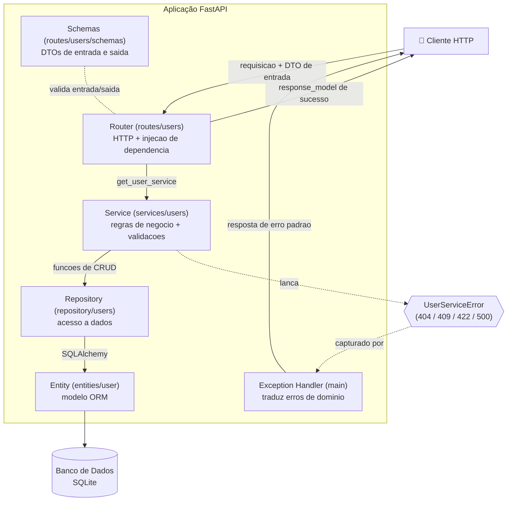
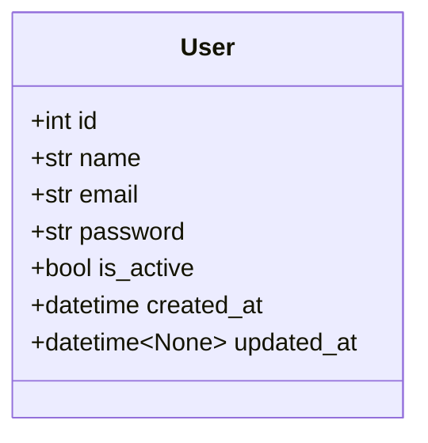
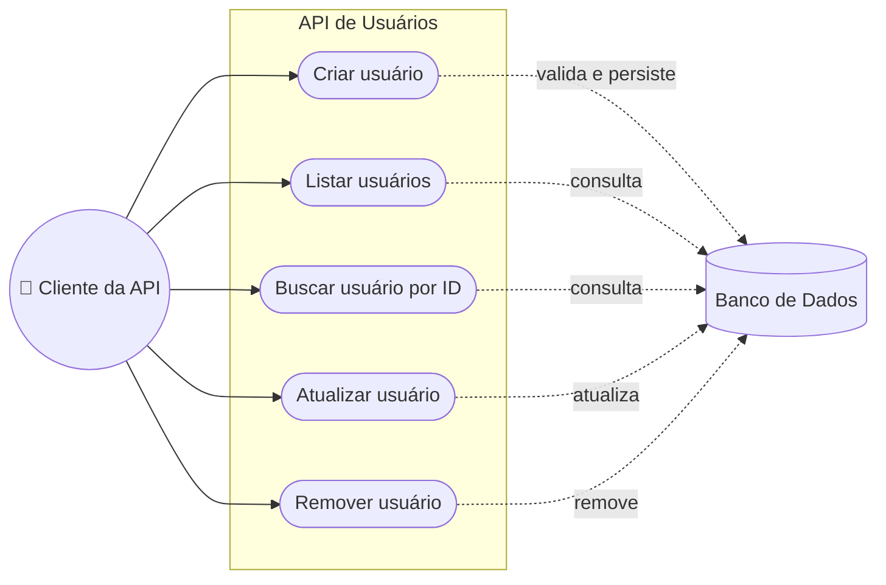

# 🚀 Desafio Técnico - API de Usuários

## 📖 Contexto

Recentemente, um dos desenvolvedores da equipe recebeu a missão de criar uma API para gerenciamento de usuários.

O projeto foi entregue e já está funcionando, mas existe um detalhe: era a primeira vez que esse desenvolvedor trabalhava sozinho em uma API desse porte. 😅

Como acontece em muitos projetos reais, a aplicação evoluiu, algumas decisões foram tomadas com pressa, outras poderiam ter sido melhor planejadas e alguns pontos acabaram ficando para trás durante o desenvolvimento.

Agora você recebeu a responsabilidade de assumir essa base de código.

Sua missão não é reescrever tudo do zero.

Queremos entender como você investiga uma aplicação existente, identifica oportunidades de melhoria e realiza ajustes que deixem o projeto mais confiável, organizado e fácil de manter.

---

## 🎯 Objetivo

Analise a API existente e faça as melhorias que considerar necessárias.

Não existe uma lista fechada de problemas para corrigir.

Queremos observar como você explora a aplicação, interpreta o código e toma decisões técnicas para evoluir o projeto.

Pense como alguém que acabou de entrar em uma equipe e recebeu a tarefa de dar continuidade a um sistema já em produção.

---

## 🤖 Uso de Inteligência Artificial

O uso de ferramentas de IA é permitido.

No entanto, durante a avaliação, você poderá ser questionado sobre as alterações realizadas.

Por isso, é importante compreender e conseguir explicar as decisões tomadas ao longo do desenvolvimento.

---

## ▶️ Como Executar o Projeto

### Criar ambiente virtual

```bash
python -m venv .venv
```

### Ativar ambiente virtual

**Windows**

```bash
.venv\Scripts\activate
```

**Linux/MacOS**

```bash
source .venv/bin/activate
```

### Instalar dependências

```bash
pip install -r requirements.txt
```

### Inicializar banco de dados

```bash
python database/seed.py
```

### Executar a API

```bash
uvicorn main:app --reload
```

### Documentação

```text
http://localhost:8000/api/users/docs
```

---

## 🏗️ Arquitetura

A aplicação segue uma **arquitetura em camadas**, com responsabilidades bem separadas:



**Fluxo de uma requisição:**

1. O **Router** recebe a requisição HTTP, valida o corpo com o **DTO de entrada** (`UserCreate`/`UserUpdate`) e injeta o `UserService` via `Depends(get_user_service)`.
2. O **Service** aplica as regras de negócio (validações, duplicidade) e orquestra a operação.
3. O **Repository** executa o acesso ao banco usando SQLAlchemy.
4. A **Entity** representa a tabela `users` no banco.
5. Na resposta de sucesso, o **`response_model`** (`UserResponse` e envelopes) serializa a saída de forma padronizada, **sem expor a senha**.
6. Erros de negócio são lançados como exceções de domínio (`UserServiceError` e subclasses) e convertidos em respostas padronizadas pelo **Exception Handler** registrado no `main.py`.

| Camada | Pasta | Responsabilidade |
|---|---|---|
| Router | `routes/users/router.py` | HTTP, injeção de dependência, `response_model` |
| Schemas (DTOs) | `routes/users/schemas.py` | Contrato de entrada (validação) e de saída (`response_model`, sem expor a senha) |
| Service | `services/users.py` | Regras de negócio, validações de domínio, orquestração |
| Repository | `repository/users.py` | Acesso a dados (queries e persistência) |
| Entity | `entities/user.py` | Modelo ORM (mapeamento da tabela) |
| Exception Handler | `main.py` | Traduz erros de domínio para o formato de resposta padrão |

---

## 🧪 Testes

O projeto possui uma suíte de testes automatizados com **pytest**, organizada em **dois níveis** complementares:

* **Testes de integração** (`tests/test_users.py`) → exercitam o fluxo HTTP completo via `TestClient`, validando status codes e o formato das respostas de cada endpoint.
* **Testes unitários** (`tests/test_user_service.py`) → exercitam a regra de negócio do `UserService` de forma isolada (sem HTTP), validando as exceções de domínio diretamente.

### Configuração do ambiente de testes

Os testes rodam de forma isolada, sem afetar o banco de dados real (`dev.db`). Cada teste utiliza um banco **SQLite em memória** criado e destruído automaticamente, e a dependência `get_db` é sobrescrita para apontar para esse banco temporário.

Arquivos relacionados:

* `requirements-dev.txt` → dependências de desenvolvimento/teste (`pytest`, `httpx`);
* `pytest.ini` → configuração do pytest (descoberta de testes e opções);
* `tests/conftest.py` → fixtures que preparam o banco em memória e o cliente de teste;
* `tests/test_users.py` → testes de integração dos endpoints de usuários;
* `tests/test_user_service.py` → testes unitários da camada de service.

### Instalar dependências de teste

```bash
pip install -r requirements-dev.txt
```

### Executar os testes

```bash
python -m pytest
```

Para ver a cobertura de cenários de um endpoint específico:

```bash
python -m pytest tests/test_users.py -k delete
```

---

## 📌 Endpoints Disponíveis

* `POST /users/`
* `GET /users/`
* `GET /users/{user_id}`
* `PATCH /users/{user_id}`
* `DELETE /users/{user_id}`

> **Nota:** o endpoint legado `POST /users/create` foi **removido** por ser redundante com `POST /users/` e por conter bugs (verificação de duplicidade incorreta e ausência de validações). Como o projeto não possui consumidores externos, optei pela remoção; em um cenário de produção, a rota seria marcada como `deprecated` antes de uma remoção definitiva.

---

## 🗂️ Modelo de Dados

Diagrama de classe da entidade `User` (tabela `users`):



| Campo | Tipo | Restrições | Descrição |
|---|---|---|---|
| `id` | `int` | PK, indexado | Identificador único do usuário |
| `name` | `str(120)` | obrigatório | Nome do usuário |
| `email` | `str(255)` | obrigatório, indexado | E-mail do usuário |
| `password` | `str(255)` | obrigatório | Senha do usuário |
| `is_active` | `bool` | obrigatório, default `true` | Indica se o usuário está ativo |
| `created_at` | `datetime` | obrigatório, default `utc_now` | Data de criação do registro |
| `updated_at` | `datetime \| None` | opcional | Data da última atualização |

---

## 🧩 Diagrama de Casos de Uso

Representação dos casos de uso da API a partir do ator que a consome:



| Caso de uso | Endpoint | Descrição |
|---|---|---|
| Criar usuário | `POST /users/` | Cadastra um novo usuário após validar os dados |
| Listar usuários | `GET /users/` | Lista os usuários com paginação (`skip`/`limit`) |
| Buscar usuário por ID | `GET /users/{user_id}` | Retorna um usuário específico |
| Atualizar usuário | `PATCH /users/{user_id}` | Atualiza parcialmente os dados de um usuário |
| Remover usuário | `DELETE /users/{user_id}` | Exclui um usuário do banco |

---

## ✅ Melhorias Realizadas

Resumo das alterações feitas sobre a base de código original:

### Correções de bugs

* **`delete_user` removia o usuário errado** — a query usava `User.id == user_id + 1`. Corrigido para o `id` correto.
* **Verificação de duplicidade ineficaz no `create_user`** — comparava `User.name == email`. Corrigido para comparar `User.email`.
* **`is_active=false` era ignorado no `update_user`** — a checagem `if campo:` descartava valores falsy. Trocado por `is not None`.
* **`updated_at` não era atualizado no PATCH** — agora é preenchido a cada atualização.

### Padronização

* Respostas de erro unificadas (formato e status codes corretos: `404`, `409`, `422`, `500`).
* Mensagens de sucesso/erro reescritas em tom profissional.
* E-mail sempre normalizado para minúsculas.

### Arquitetura

* Introdução de uma **arquitetura em camadas** (`router → service → repository → entity`).
* Camada de **service** com regras de negócio e **injeção de dependência** (`Depends(get_user_service)`).
* **DTOs** de entrada extraídos para `routes/users/schemas.py`.
* **Exception handler** centralizado para traduzir erros de domínio.
* Integração da camada de **repository** (antes não utilizada) como única fonte de acesso a dados.

### Documentação e testes

* Documentação **Swagger** completa (summary, description, docstrings e exemplos).
* Suíte de **testes automatizados** (integração + unitários).
* Diagramas de arquitetura, modelo de dados e casos de uso no README.

### Limpeza

* Removido o endpoint legado `POST /users/create` (redundante e com bugs).
* Removido o endpoint de debug `/debug/users-count` e helpers não utilizados do `main.py`.
* Migração de `example` (depreciado) para `examples` na documentação.

### Pontos mapeados para evolução futura

Itens identificados e propositalmente deixados para uma próxima etapa:

* **Segurança da senha:** hoje a senha é armazenada em texto plano e retornada nas respostas. Recomenda-se aplicar hash e introduzir um DTO de saída (`UserResponse`) que a omita.
* **Unicidade de e-mail no banco:** a coluna `email` deveria ter `unique=True` para garantir a integridade também no nível do banco.
* **Validação de e-mail:** poderia usar `EmailStr` do Pydantic para uma validação mais robusta.

---

## 📦 O Que Esperamos na Entrega

Sua entrega deve conter:

* Código atualizado;
* Melhorias que você considerar relevantes;
* Instruções para execução do projeto;
* Explicação das alterações realizadas;
* Justificativas para decisões importantes;
---

## 📝 Importante

Não buscamos uma solução perfeita.

O objetivo deste desafio é entender como você trabalha com uma base de código existente, como investiga problemas, organiza suas ideias e evolui uma aplicação de forma incremental.

Explique suas decisões, documente seu raciocínio e sinta-se à vontade para apontar pontos que você optou por não alterar.

Boa sorte! 🍀
